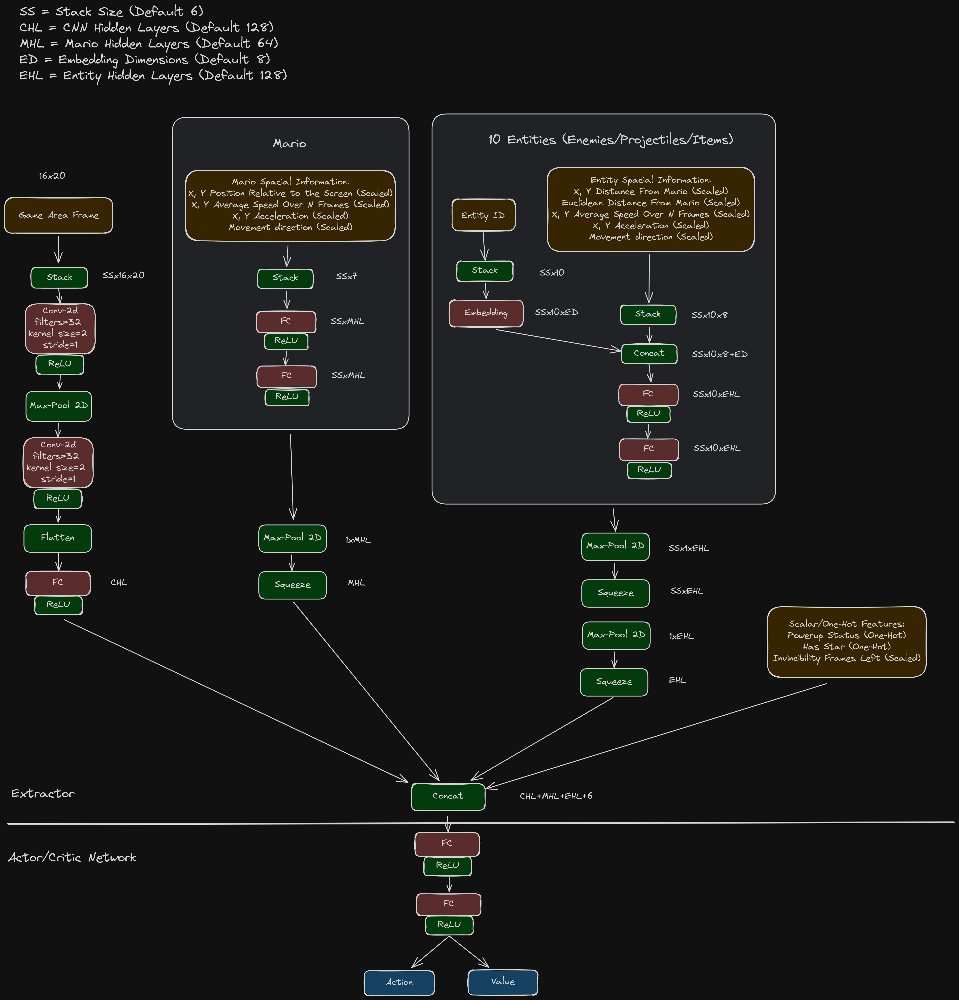

# Super Mario Land

Changes to training that have improved model performance:

- Training is done over all levels
    - This prevents agents from overfitting on a single level
- A training episode starts from the beginning, middle or end of a random level
    - This allows agents to learn from more of the game in the beginning of training before its good enough to progress further into levels by itself
- Lives left are randomly set from 0-2
    - This increases stochasticity in the environment and allows agents to learn how to strategically handle lives throughout the entire game
- When beginning an episode there's a small chance Mario will be given a random powerup
    - This increases stochasticity in the environment and allows agents to learn how to play when different powerups are active
- After a death the timer is not set back to the maximum time (what vanilla SML does) but instead set to what it was at the time of the death plus a small amount of time
    - This prevents episodes continuing indefinitely if an agent learns how to get a 1up, die, respawn behind the 1up, get a 1up, etc
- Actions have a small chance to be sticky, ie the current action will be ignored and the previous action will be used instead
    - This greatly increases stochasticity in the environment and prevents agents from memorizing optimal actions that will clear a level in favor of actually learning game mechanics
- Episodes only end on a game over, so agents can learn to continue after respawning or play through multiple levels at a time

Evaluations are handled very similarly but some modifications are made to make the environment deterministic:

- Actions are never sticky
- Lives left is always 1
- Mario always starts small
- Episodes end on a game over, if a level is cleared or if the agent fails to make progress in a level for more than 15 seconds

## Neural Network Architecture

A custom NN architecture was designed and used to give agents more information about the environment than they could reasonably obtain and learn with just game frames. This has greatly improved trained model performance, and allowed them to more accurately predict and react to object and enemy movements and trajectories.

